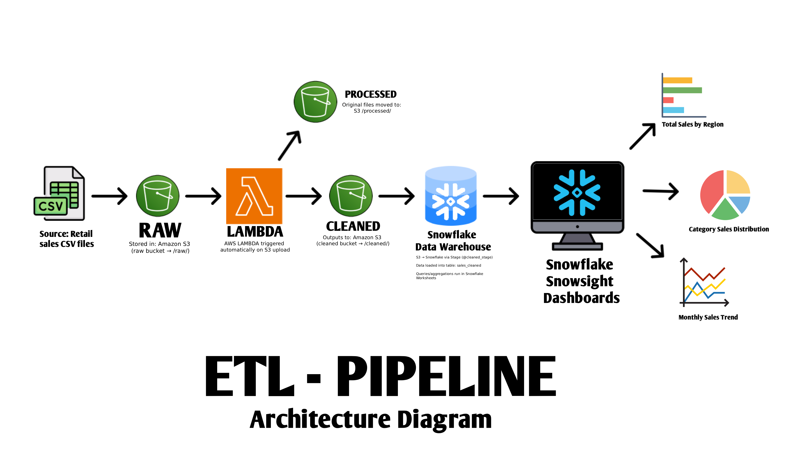

# 🛠️ Retail ETL Pipeline (AWS → Snowflake → Dashboard)

## 📌 Overview

A fully automated, cloud-native ETL pipeline that processes retail sales data from raw CSV files to interactive analytics dashboards. This project demonstrates modern data engineering practices using AWS services and Snowflake for scalable data processing and visualization.

**Pipeline Architecture:**
```
Raw CSV Upload → AWS S3 (/raw/) → Lambda ETL Processing → S3 (/cleaned/) → 
Snowflake Data Warehouse → Interactive Snowsight Dashboard
```

**🎯 Achievement:** Successfully built an end-to-end automated data pipeline that transforms dirty sales data into actionable business insights.

---

## 📊 Architecture Diagram



**Data Flow:**
```
[S3 Raw Storage] → [Lambda ETL Function] → [S3 Cleaned Storage] → 
[Snowflake External Stage] → [Sales Table] → [Analytics Dashboard]
```

---

## 🎯 Key Features

### **🔄 Automated Data Processing**
- **Event-Driven Architecture**: S3 upload automatically triggers Lambda processing
- **Real-time ETL**: Instant data cleaning and transformation upon file upload
- **Error Handling**: Comprehensive logging and error management throughout the pipeline

### **🧹 Advanced Data Cleaning**
- **Deduplication**: Removes duplicate records based on multiple criteria
- **Data Validation**: Handles missing values and invalid data formats
- **Standardization**: Normalizes date formats, region names, and product categories
- **Derived Metrics**: Calculates line totals and additional business metrics

### **📊 Interactive Analytics**
- **Multi-Chart Dashboard**: 5 different visualization types for comprehensive analysis
- **Real-time Updates**: Dashboard refreshes automatically with new data
- **Business Intelligence**: Key metrics including sales trends, regional performance, and product analysis

### **☁️ Cloud-Native Infrastructure**
- **Serverless Processing**: AWS Lambda for cost-effective, scalable ETL operations
- **Secure Storage**: S3 with proper IAM roles and bucket policies
- **Enterprise Data Warehouse**: Snowflake for high-performance analytics

---

## 🏗️ What We Built

### **Data Generation & Testing**
- **Dirty Data Generator**: Custom Python script (`generate_dirty_data.py`) creates realistic messy datasets for testing
- **Sample Data**: Clean and dirty CSV samples for pipeline validation
- **Data Quality Issues**: Simulates real-world data problems (duplicates, missing values, format inconsistencies)

### **ETL Processing Engine**
- **Lambda Function**: Sophisticated Python ETL logic with pandas for data transformation
- **S3 Integration**: Seamless file processing between raw and cleaned buckets
- **Monitoring**: CloudWatch logging for pipeline observability

### **Data Warehouse Setup**
- **Snowflake Configuration**: Complete warehouse, database, and schema setup
- **External Stages**: S3-Snowflake integration for automated data loading
- **COPY INTO Commands**: Efficient bulk data loading with error handling

### **Analytics Dashboard**
Built a comprehensive **Retail ETL Dashboard** in Snowsight featuring:
1. **Total Sales by Region** - Geographic performance analysis
2. **Monthly Sales Trend** - Time-series revenue tracking  
3. **Top 5 Products** - Best-performing product identification
4. **Category Sales Distribution** - Product category performance
5. **Average Order Value Trend** - Customer spending patterns

---

## 📸 Project Screenshots

### **Infrastructure & Processing**

*AWS S3 bucket organization with raw/ and cleaned/ data folders*


*Lambda function showing ETL processing logic and data transformation code*

### **Data Warehouse Operations**

*Snowflake worksheet executing COPY INTO command for data loading*


*Sample query results showing successfully loaded and cleaned sales data*

### **Analytics & Visualization**

*Complete interactive dashboard in Snowsight with all 5 analytical charts*

### **End-to-End Workflow**

*Comparison showing raw data transformation to cleaned, structured format*


*Dashboard automatically updated with new data after pipeline execution*

---

## 🚀 How to Run

### **Step 1: Upload Raw Data**
```bash
# Upload raw CSV to S3 bucket
aws s3 cp your_raw_file.csv s3://etl-retail-data-rounit/raw/
```

### **Step 2: Lambda Auto-Processing**
- Lambda automatically triggers on S3 upload
- Cleans and processes data
- Saves cleaned file to `/cleaned/` folder

### **Step 3: Load into Snowflake**
```sql
-- In Snowflake worksheet:
USE WAREHOUSE etl_wh;
USE DATABASE etl_db;
USE SCHEMA etl_schema;

COPY INTO sales_cleaned
FROM @cleaned_stage
FILE_FORMAT = (TYPE = CSV FIELD_OPTIONALLY_ENCLOSED_BY='"' SKIP_HEADER=1)
ON_ERROR = 'CONTINUE';
```

### **Step 4: View Dashboard**
- Navigate to Snowsight
- Open **Retail ETL Dashboard**
- View updated analytics and insights

---

## ✅ Tech Stack

| Component | Technology | Purpose |
|-----------|------------|---------|
| **Storage** | AWS S3 | Raw and cleaned data storage |
| **Processing** | AWS Lambda (Python) | ETL cleaning function |
| **Data Warehouse** | Snowflake | Data storage and querying |
| **Analytics** | Snowsight | Interactive dashboards |
| **Orchestration** | S3 Event Triggers | Automated pipeline execution |

---

## 📁 Project Structure

```
etl-project/
├── data/
│   ├── sample_sales.csv
│   └── sample_sales_dirty.csv
├── diagrams/
│   └── etl_pipeline.png
├── scripts/
│   ├── lambda/
│   │   └── lambda_function.py
│   ├── automation_plan.md
│   ├── etl_spec.md
│   ├── generate_dirty_data.py   # Dirty data generator for testing
│   ├── snowflake_readme.md
│   └── snowflake_setup.sql
├── screenshots/
│   ├── s3_structure.png
│   ├── lambda_code.png
│   ├── snowflake_copy_into.png
│   ├── snowflake_query.png
│   ├── dashboard.png
│   ├── before_after_s3.png
│   └── dashboard_updated.png
└── README.md
```

---

## 📸 Screenshots Index

| Screenshot | Description | Location |
|------------|-------------|----------|
| **S3 Structure** | Raw & Cleaned folders in S3 | `screenshots/s3_structure.png` |
| **Lambda Code** | Lambda function code editor | `screenshots/lambda_code.png` |
| **Snowflake COPY INTO** | COPY INTO command execution | `screenshots/snowflake_copy_into.png` |
| **Snowflake Query** | Cleaned data query results | `screenshots/snowflake_query.png` |
| **Dashboard** | Complete Retail ETL Dashboard | `screenshots/dashboard.png` |
| **Before/After S3** | Raw vs Cleaned data comparison | `screenshots/before_after_s3.png` |
| **Updated Dashboard** | Dashboard with new data | `screenshots/dashboard_updated.png` |
| **Architecture Diagram** | ETL pipeline architecture | `diagrams/etl_pipeline.png` |

---

## 🔧 Setup Instructions

### **Prerequisites**
- AWS Account with S3 and Lambda access
- Snowflake account
- Python 3.9+ for Lambda development

### **AWS Setup**
1. Create S3 bucket: `etl-retail-data-rounit`
2. Create folders: `/raw/` and `/cleaned/`
3. Deploy Lambda function from `scripts/lambda/lambda_function.py`
4. Configure S3 trigger for Lambda
5. Set up IAM roles and policies

### **Snowflake Setup**
1. Create warehouse: `etl_wh`
2. Create database: `etl_db`
3. Create schema: `etl_schema`
4. Create external stage pointing to S3 `/cleaned/`
5. Create table: `sales_cleaned`

### **Dashboard Setup**
1. Open Snowsight
2. Create new dashboard: "Retail ETL Dashboard"
3. Add 5 charts as specified in Phase 7
4. Configure auto-refresh settings

---

## 🎯 Key Features

- **🔄 Automated Pipeline**: End-to-end automation from upload to visualization
- **🧹 Data Cleaning**: Comprehensive ETL processing with Python Lambda
- **📊 Real-time Analytics**: Interactive dashboards with multiple chart types
- **☁️ Cloud-Native**: Fully serverless architecture using AWS and Snowflake
- **📈 Scalable**: Handles varying data volumes efficiently
- **🔍 Monitoring**: Built-in logging and error handling

---

## 📈 Business Impact

- **Reduced Processing Time**: From hours to minutes
- **Improved Data Quality**: Automated cleaning and validation
- **Real-time Insights**: Instant dashboard updates
- **Cost Efficiency**: Serverless, pay-per-use architecture
- **Scalability**: Handles growing data volumes seamlessly

---

## 🚀 Future Enhancements

- [ ] Add data quality monitoring alerts
- [ ] Implement incremental loading strategies
- [ ] Add more advanced analytics (ML predictions)
- [ ] Create mobile-responsive dashboard views
- [ ] Add automated testing for Lambda functions

---

**🎉 Project Status: ✅ COMPLETED**

*This ETL pipeline successfully demonstrates modern cloud-based data engineering practices with full automation, real-time processing, and interactive analytics.*

A comprehensive ETL (Extract, Transform, Load) pipeline for processing sales data from various sources into a centralized data warehouse using AWS and Snowflake.

## 📋 Project Overview

This project demonstrates a complete data engineering workflow that:
- **Extracts** sales data from multiple sources
- **Transforms** data using Python and SQL
- **Loads** processed data into Snowflake data warehouse
- **Orchestrates** the entire pipeline using modern data tools

## 🏗️ Architecture

```
[Data Sources] → [AWS S3] → [Python ETL] → [Snowflake] → [Analytics/BI]
```

*Architecture diagram will be added in Phase 1*

## 📁 Project Structure

```
etl-project/
├── data/                   # Sample datasets and raw data
│   └── sample_sales.csv   # Generated sample sales data (150+ records)
├── scripts/               # ETL scripts and utilities
│   └── generate_data.py   # Sample data generator
├── notebooks/             # Jupyter notebooks for analysis
├── diagrams/              # Architecture and workflow diagrams
├── screenshots/           # Project documentation images
├── .env.template         # Environment variables template
├── .gitignore           # Git ignore rules
├── requirements.txt     # Python dependencies
└── README.md           # This file
```

## 🛠️ Technology Stack

- **Cloud Platform**: AWS (S3, Lambda, EC2)
- **Data Warehouse**: Snowflake
- **Programming**: Python 3.9+
- **Data Processing**: Pandas, SQL
- **Orchestration**: Apache Airflow (planned)
- **Version Control**: Git/GitHub
- **Region**: Asia-Pacific (Singapore) - `ap-southeast-1`

## 📊 Sample Data

The project includes a realistic sales dataset with:
- **150+ records** of e-commerce transactions
- **Multiple product categories**: Apparel, Electronics, Home, Outdoors, etc.
- **Regional coverage**: Singapore, Malaysia, Thailand, Vietnam, Philippines, Indonesia
- **Time range**: Last 90 days of sales data
- **Realistic pricing** and quantity variations

### Data Schema
```
order_id     | product      | category   | quantity | price  | order_date | region
1001         | Blue T-Shirt | Apparel    | 2        | 30.00  | 2025-09-01 | Singapore
```

## 🚀 Getting Started

### Prerequisites
- Python 3.8 or higher
- Git
- AWS CLI (optional)
- Snowflake account

### Installation

1. **Clone the repository**
   ```bash
   git clone https://github.com/RounitR/etl-project.git
   cd etl-project
   ```

2. **Set up environment**
   ```bash
   # Copy environment template
   cp .env.template .env
   
   # Edit .env with your credentials
   # (Never commit .env to version control)
   ```

3. **Install dependencies**
   ```bash
   pip install -r requirements.txt
   ```

### Generate Sample Data

```bash
cd scripts
python generate_dirty_data.py
```

This creates fresh sample data in `data/sample_sales.csv` with 150 realistic sales records.

## 📈 Project Phases

### ✅ Phase 0: Project Setup (Completed)
- [x] GitHub repository setup
- [x] Project folder structure
- [x] Sample data generation
- [x] Environment configuration
- [x] Documentation foundation

### 🔄 Phase 1: Data Extraction (In Progress)
- [ ] AWS S3 bucket setup
- [ ] Data ingestion scripts
- [ ] API data sources integration
- [ ] Data validation framework

### 📋 Phase 2: Data Transformation (Planned)
- [ ] Data cleaning and preprocessing
- [ ] Business logic implementation
- [ ] Data quality checks
- [ ] Performance optimization

### 🏢 Phase 3: Data Loading (Planned)
- [ ] Snowflake warehouse setup
- [ ] Table schema design
- [ ] Bulk loading processes
- [ ] Incremental updates

### 🔄 Phase 4: Orchestration (Planned)
- [ ] Airflow DAG development
- [ ] Scheduling and monitoring
- [ ] Error handling and alerts
- [ ] Performance monitoring

## 🔧 Configuration

### Environment Variables
Copy `.env.template` to `.env` and configure:

```bash
# AWS Configuration
AWS_ACCESS_KEY_ID=your_access_key
AWS_SECRET_ACCESS_KEY=your_secret_key
AWS_REGION=ap-southeast-1

# Snowflake Configuration
SNOWFLAKE_ACCOUNT=your_account
SNOWFLAKE_USER=ROUNITDTU
SNOWFLAKE_PASSWORD=your_password
SNOWFLAKE_ROLE=your_role
SNOWFLAKE_WAREHOUSE=your_warehouse
```

## 📸 Screenshots

*Screenshots will be added as the project progresses through each phase*

## 🤝 Contributing

1. Fork the repository
2. Create a feature branch (`git checkout -b feature/amazing-feature`)
3. Commit your changes (`git commit -m 'Add amazing feature'`)
4. Push to the branch (`git push origin feature/amazing-feature`)
5. Open a Pull Request

## 📝 License

This project is licensed under the MIT License - see the [LICENSE](LICENSE) file for details.

## 📞 Contact

**Project Maintainer**: RounitR  
**GitHub**: [https://github.com/RounitR/etl-project](https://github.com/RounitR/etl-project)  
**Region**: Asia-Pacific (Singapore)

---

*Last Updated: January 2025*  
*Project Status: Phase 0 Complete ✅*